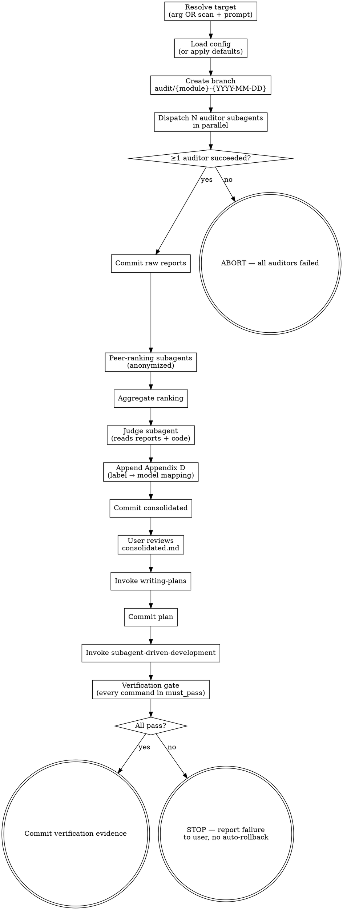

# Auditing-Codebase Skill Implementation Plan

> **For agentic workers:** REQUIRED SUB-SKILL: Use superpowers:subagent-driven-development (recommended) or superpowers:executing-plans to implement this plan task-by-task. Steps use checkbox (`- [ ]`) syntax for tracking.

**Goal:** Build the `auditing-codebase` skill that orchestrates multi-model parallel audits, peer-ranking, judge consolidation, plan generation, and verified implementation on a dedicated git branch.

**Architecture:** A pi skill (markdown + reference files, no code) that composes existing skills (`dispatching-parallel-agents`, `writing-plans`, `subagent-driven-development`, `verification-before-completion`). Inspiration for anonymized peer-ranking taken from the `council/` extension. The skill itself produces no runtime code — it is documentation that guides an agent through the audit lifecycle. Validation happens via subagent pressure scenarios (per `writing-skills` TDD discipline).

**Tech Stack:** Markdown (SKILL.md, templates), YAML (config), Rust toolchain commands for verification (`cargo build/test/clippy/fmt`).

**Spec:** `docs/superpowers/specs/2026-05-21-auditing-codebase-design.md`

---

## File Structure

The skill produces no runtime code. All deliverables are documentation/reference files under a new directory `skills/auditing-codebase/`:

- Create: `skills/auditing-codebase/SKILL.md` — Main reference (overview + flowchart + checklist). Target <500 words in core sections, frontmatter description follows `writing-skills` CSO rules.
- Create: `skills/auditing-codebase/audit-config.example.yaml` — Copy-paste template for `docs/audits/audit-config.yaml`.
- Create: `skills/auditing-codebase/auditor-prompt-template.md` — Heavy reference. Detailed prompt the orchestrator passes to each auditor subagent.
- Create: `skills/auditing-codebase/peer-ranking-prompt-template.md` — Heavy reference. Prompt for stage 1.5 anonymous peer-ranking.
- Create: `skills/auditing-codebase/judge-prompt-template.md` — Heavy reference. Prompt for the judge subagent including the classification schema, code-verification requirement, and the consolidated report format.
- Create: `docs/superpowers/tests/auditing-codebase-scenarios.md` — Pressure scenarios used during TDD validation. Lives outside the skill itself so it does not load into context every time the skill is read.

Each file has one clear responsibility:
- SKILL.md = orchestration logic, decision points, flowchart
- Templates = prompts loaded by the orchestrator only when dispatching that specific stage
- Example yaml = user copies and edits per-project
- Scenarios = TDD evidence, used during construction and future maintenance

---

### Task 1: Baseline scenario — capture how an agent audits without the skill (RED)

**Files:**
- Create: `docs/superpowers/tests/auditing-codebase-scenarios.md`

- [ ] **Step 1: Write the baseline pressure scenario**

Create the scenarios file with the very first scenario, designed to capture the BASELINE behavior before the skill exists. This is the "failing test" in TDD terms for skills.

Write this content to `docs/superpowers/tests/auditing-codebase-scenarios.md`:

```markdown
# Auditing-Codebase Skill — Pressure Scenarios

This file holds the TDD evidence for the `auditing-codebase` skill, per the `writing-skills` discipline. Each scenario is a prompt dispatched to a fresh subagent. Baselines are run WITHOUT the skill; verification runs WITH the skill.

## Scenario 1 — Baseline: "audit my crate"

**Setup:** Pick any small Rust crate in this repo. Dispatch a fresh subagent (model: `sonnet`) with NO mention of the `auditing-codebase` skill.

**Prompt:**
> Audit the Rust crate at `crates/<pick-one>`. I want multiple perspectives on what is wrong with it and a plan to fix it. Make sure tests still pass when you are done.

**Measure (document verbatim):**
- Did the agent run multiple model perspectives, or just one?
- Did it create a dedicated branch?
- Did it persist any audit reports to disk?
- Did it filter false positives against the code?
- Did it produce a remediation plan?
- Did it run `cargo test` AND `cargo clippy` AND `cargo fmt --check` at the end?
- What rationalizations did it use to skip any of the above?

**Expected baseline failures** (these are what the skill must address):
- Single perspective, no peer review
- No branch created
- No structured persistence
- No code-level verification of findings
- Verification skipped or partial
```

- [ ] **Step 2: Run the baseline scenario**

Dispatch a subagent using the Agent tool:
- `subagent_type: general-purpose`
- `model: sonnet`
- `prompt`: copy the scenario prompt above, with a real crate path picked from `crates/`.
- Do NOT mention `auditing-codebase`.

- [ ] **Step 3: Capture the baseline result verbatim**

Append a `### Baseline result` subsection to Scenario 1 in the scenarios file with a verbatim summary of what the agent did and which expected failures occurred. Quote any rationalizations the agent used.

- [ ] **Step 4: Commit**

```bash
git add docs/superpowers/tests/auditing-codebase-scenarios.md
git commit -m "test: capture baseline scenario for auditing-codebase skill"
```

---

### Task 2: Add the example config file

**Files:**
- Create: `skills/auditing-codebase/audit-config.example.yaml`

- [ ] **Step 1: Write the example config**

Write this exact content to `skills/auditing-codebase/audit-config.example.yaml`:

```yaml
# Copy this file to docs/audits/audit-config.yaml in your project and edit.
# Every field is optional; defaults match the values below.

# Auditor models. 1–4 entries. Default is the first 3.
# Format: pi fuzzy name ("sonnet", "opus") OR provider/model-id ("openrouter/anthropic/claude-opus-4.6").
auditors:
  - sonnet
  - opus
  - gpt-5

# Judge model. Reads anonymized reports + peer rankings + actual source code.
# Should be a strong reasoning model.
judge: opus

# Lens skill applied by each auditor. Examples:
#   rust-review                    (default)
#   improve-codebase-architecture
#   rust-perf
#   rust-doc-comments
lens: rust-review

# Verification gate. Every command must exit 0 before the audit is considered complete.
# The defaults below cover most Rust workspaces; override per project.
verification:
  must_pass:
    - cargo build --workspace --all-targets
    - cargo test --workspace --all-features
    - cargo clippy --workspace --all-targets --all-features -- -D warnings
    - cargo fmt --all -- --check
```

- [ ] **Step 2: Verify the file is syntactically valid YAML**

Run: `python3 -c "import yaml,sys; yaml.safe_load(open('skills/auditing-codebase/audit-config.example.yaml'))" && echo OK`
Expected: prints `OK`

- [ ] **Step 3: Commit**

```bash
git add skills/auditing-codebase/audit-config.example.yaml
git commit -m "feat(auditing-codebase): add example config"
```

---

### Task 3: Write the auditor prompt template

**Files:**
- Create: `skills/auditing-codebase/auditor-prompt-template.md`

- [ ] **Step 1: Write the template**

Write this exact content to `skills/auditing-codebase/auditor-prompt-template.md`:

````markdown
# Auditor Prompt Template

The orchestrator (SKILL.md) interpolates the placeholders below before dispatching the subagent. Placeholders use `{{NAME}}` syntax.

## Placeholders

- `{{TARGET}}` — absolute or repo-relative path being audited (e.g. `crates/striper-pedront`)
- `{{MODULE_NAME}}` — short name used in filenames (e.g. `striper-pedront`)
- `{{LABEL}}` — anonymous label for this auditor (`a`, `b`, `c`, or `d`)
- `{{LENS_SKILL}}` — name of the skill to apply (`rust-review`, `improve-codebase-architecture`, ...)
- `{{BRANCH}}` — dedicated audit branch (e.g. `audit/striper-pedront-2026-05-21`)

## Prompt

```
You are auditor `{{LABEL}}` in a multi-model code audit. Your work is anonymous —
other auditors and the judge will see only your label, not which model you are.

## Task

1. Apply the `{{LENS_SKILL}}` skill to the target: `{{TARGET}}`.
2. Read the actual source files in `{{TARGET}}` thoroughly before writing findings.
   Every finding you report MUST cite a specific file path and line range.
3. Write your findings to `docs/audits/{{MODULE_NAME}}-{{LABEL}}.md` using the
   structure below. Do not write anywhere else. Do not modify source code.
4. When done, output ONLY the path of the file you wrote.

## Required report structure

```markdown
# Audit Report — {{MODULE_NAME}} (auditor {{LABEL}})
Lens: {{LENS_SKILL}}
Date: <YYYY-MM-DD>

## Summary
<2–3 sentences: what did you look at, how many findings, overall health>

## Findings

### [{{LABEL}}-001] <Short title>
- **Severity:** critical | high | medium | low
- **Location:** `path/from/repo-root.rs:LSTART-LEND`
- **Evidence (code excerpt):**
  ```rust
  // paste the exact lines
  ```
- **Problem:** <what is wrong and why it matters>
- **Suggested remediation:** <concrete change>
- **Effort estimate:** small | medium | large

### [{{LABEL}}-002] ...
```

## Hard rules

- DO NOT modify any source file. You are read-only on the codebase.
- DO NOT write outside `docs/audits/{{MODULE_NAME}}-{{LABEL}}.md`.
- DO NOT include findings that you have not verified against the actual source.
- DO NOT skip the `Evidence` block — every finding needs a code excerpt.
- If you find nothing wrong, write a report with an empty `## Findings` section
  and explain in `## Summary` why the module looks healthy.

You are on branch `{{BRANCH}}`. Do not commit — the orchestrator handles commits.
```
````

- [ ] **Step 2: Sanity check placeholders**

Run: `grep -oE '\{\{[A-Z_]+\}\}' skills/auditing-codebase/auditor-prompt-template.md | sort -u`
Expected output (exact set):
```
{{BRANCH}}
{{LABEL}}
{{LENS_SKILL}}
{{MODULE_NAME}}
{{TARGET}}
```

- [ ] **Step 3: Commit**

```bash
git add skills/auditing-codebase/auditor-prompt-template.md
git commit -m "feat(auditing-codebase): add auditor prompt template"
```

---

### Task 4: Write the peer-ranking prompt template

**Files:**
- Create: `skills/auditing-codebase/peer-ranking-prompt-template.md`

- [ ] **Step 1: Write the template**

Write this exact content to `skills/auditing-codebase/peer-ranking-prompt-template.md`:

````markdown
# Peer-Ranking Prompt Template

Used in Stage 1.5. Each successful auditor evaluates the other reports anonymously
and returns a ranking. Inspired by the `council/` extension's Stage 2.

## Placeholders

- `{{MODULE_NAME}}` — short module name
- `{{LENS_SKILL}}` — the lens used by the auditors
- `{{REPORTS_BLOCK}}` — the concatenated anonymized reports, formatted as shown below
- `{{VALID_LABELS}}` — the list of valid labels in this run, e.g. `auditor_a, auditor_b, auditor_c`

### REPORTS_BLOCK formatting

The orchestrator builds this block by concatenating each successful auditor's
file content, separated by a horizontal rule and a heading:

```
## auditor_a

<full contents of docs/audits/{{MODULE_NAME}}-a.md>

---

## auditor_b

<full contents of docs/audits/{{MODULE_NAME}}-b.md>

---

## auditor_c

<full contents of docs/audits/{{MODULE_NAME}}-c.md>
```

## Prompt

```
You are evaluating the quality of code-audit reports written by other engineers
on the same target (`{{MODULE_NAME}}`, lens `{{LENS_SKILL}}`). The reports are
anonymized — you see only labels (`auditor_a`, `auditor_b`, ...), never model names.

## Your job

For each report below, briefly assess:
- **Depth and specificity** — does it cite concrete file:line locations and
  evidence excerpts, or is it vague?
- **Coverage** — does it catch important issues others might miss?
- **Actionability** — are the suggested remediations concrete and implementable?
- **Signal-to-noise** — is it focused, or padded with low-value findings?

Then output a ranking from MOST to LEAST useful using EXACTLY this format
(replace `<labels>` with the actual labels, one per line, numbered):

FINAL RANKING:
1. <label>
2. <label>
3. <label>

Valid labels for this run: {{VALID_LABELS}}

You MUST rank every valid label exactly once. Do not invent labels.
Do not break the `FINAL RANKING:` heading — the orchestrator parses it literally.

---

{{REPORTS_BLOCK}}
```
````

- [ ] **Step 2: Sanity check placeholders**

Run: `grep -oE '\{\{[A-Z_]+\}\}' skills/auditing-codebase/peer-ranking-prompt-template.md | sort -u`
Expected output:
```
{{LENS_SKILL}}
{{MODULE_NAME}}
{{REPORTS_BLOCK}}
{{VALID_LABELS}}
```

- [ ] **Step 3: Commit**

```bash
git add skills/auditing-codebase/peer-ranking-prompt-template.md
git commit -m "feat(auditing-codebase): add peer-ranking prompt template"
```

---

### Task 5: Write the judge prompt template

**Files:**
- Create: `skills/auditing-codebase/judge-prompt-template.md`

- [ ] **Step 1: Write the template**

Write this exact content to `skills/auditing-codebase/judge-prompt-template.md`:

````markdown
# Judge Prompt Template

Used in Stage 2 (judge consolidation). The judge receives anonymized reports +
peer rankings AND has read access to the source code so it can verify findings.

## Placeholders

- `{{MODULE_NAME}}` — short module name
- `{{TARGET}}` — path being audited
- `{{BRANCH}}` — dedicated audit branch
- `{{LENS_SKILL}}` — lens used by the auditors
- `{{DATE}}` — today's date YYYY-MM-DD
- `{{REPORTS_BLOCK}}` — same anonymized concatenation format as in peer-ranking
- `{{AGGREGATE_RANKING_TABLE}}` — markdown table:
  ```
  | Label      | Average rank | Vote count |
  |------------|--------------|------------|
  | auditor_a  | 1.33         | 3          |
  | auditor_b  | 2.00         | 3          |
  | auditor_c  | 2.67         | 3          |
  ```
- `{{LABEL_TO_MODEL_TABLE}}` — markdown table mapping labels to real model names
  (this goes ONLY into the final report's Appendix D; the judge does NOT see it
  during reasoning to preserve anonymization). The orchestrator appends Appendix D
  to the file AFTER the judge returns its synthesis.
- `{{FAILED_AUDITORS}}` — either `none` or a comma-separated list with reasons
- `{{TOTAL_COST}}` — either `$X.XX` or `unknown`

## Prompt

```
You are the judge in a multi-model code audit of `{{TARGET}}` (module
`{{MODULE_NAME}}`, lens `{{LENS_SKILL}}`, branch `{{BRANCH}}`).

You will receive:
  1. Anonymized audit reports (labels only — do not speculate which model wrote which).
  2. A peer-ranking aggregate showing how the auditors rated each other.
  3. Read access to the actual source code at `{{TARGET}}`.

## Your job

Produce a consolidated, actionable report. For EVERY finding raised by ANY
auditor you MUST do all of the following:

1. Open the cited file(s) and verify the finding against the actual code.
2. Classify the finding using EXACTLY one of these labels:
   - **Confirmed** — You read the code and the finding is real. REQUIRED: include
     a code excerpt copied verbatim from the source file as evidence. If you
     cannot produce that excerpt, do NOT mark Confirmed — mark Disputed.
   - **False positive** — The code does not exhibit the claimed problem. Explain
     in one sentence why you reject it.
   - **Duplicate** — Same root issue as another Confirmed finding. Merge into the
     primary finding and list all reporting auditors under it.
   - **Out of scope** — Real, but outside `{{TARGET}}`. Note location for future work.
   - **Disputed** — Auditors disagree and you cannot resolve from the code alone.
     Surface for human decision.
3. Assign **severity**: critical | high | medium | low.
4. Assign **effort**: small | medium | large.
5. Mark **Quick Win** (⭐) if severity is high or critical AND effort is small.

Ordering rules for the report:
- Quick Wins section first (in the order you would tackle them).
- Then Confirmed findings grouped by severity (critical → high → medium → low).
- Within a severity bucket, sort by effort ascending (cheap fixes first).

## Required output

Write the file `docs/audits/{{MODULE_NAME}}-consolidated.md` with EXACTLY this
structure (do NOT invent extra top-level sections):

```markdown
# Audit Consolidation: {{MODULE_NAME}}
Date: {{DATE}} | Lens: {{LENS_SKILL}} | Branch: {{BRANCH}}

## Executive Summary
- Total raw findings: <N>
- Confirmed: <X> | False positives: <Y> | Duplicates merged: <Z> | Disputed: <W> | Out of scope: <V>
- Severity breakdown: critical=<A>, high=<B>, medium=<C>, low=<D>
- Quick wins identified: <K>
- Peer-ranking aggregate: <one line summary, e.g. "auditor_a led (1.33), auditor_c trailed (2.67)">
- Total cost: {{TOTAL_COST}}
- Failed auditors: {{FAILED_AUDITORS}}

## Quick Wins (high impact, low effort) — DO FIRST
1. **[QW-001] <title>** — <one-line action>
   - Severity: <s> | Effort: <e> | Reported by: <labels>
   - Location: `path:Lx-Ly`
   - Evidence: ```rust ... ```
   - Suggested remediation: <concrete change>

## Confirmed Findings
### Critical
- **[F-001] <title>**
  - Location: `path:Lx-Ly`
  - Reported by: <labels> (consensus N/M)
  - Evidence: ```rust ... ```
  - Impact: <why it matters>
  - Suggested remediation: <concrete change>
  - Effort: <s|m|l>

### High
...
### Medium
...
### Low
...

## Appendix A — False Positives (discarded)
- **[FP-001]** reported by <label> — Claim: <one line>. Why rejected: <one line>.

## Appendix B — Disputed (needs human decision)
- **[D-001]** Auditors disagreed on <topic>. <label_x> says <pos>; <label_y> says <pos>. Judge could not resolve because <reason>.

## Appendix C — Out of Scope (noted for future)
- **[OOS-001]** Real issue at `<path>` but outside `{{TARGET}}`. Summary: <one line>.
```

Note: Appendix D (Label → Model mapping) is appended by the orchestrator after
you return. Do NOT include it yourself. Do NOT speculate about which model
wrote which report.

When you are done, output ONLY the path of the file you wrote.

## Hard rules

- DO NOT modify any source file. You are read-only on the codebase.
- DO NOT write outside `docs/audits/{{MODULE_NAME}}-consolidated.md`.
- Every Confirmed finding MUST include a verbatim code excerpt from the source.
- Findings with no verifiable evidence go to Disputed, not Confirmed.
- DO NOT invent findings the auditors did not raise. You consolidate; you do not
  add fresh audit perspectives.

---

## Inputs

### Peer-ranking aggregate

{{AGGREGATE_RANKING_TABLE}}

### Auditor reports

{{REPORTS_BLOCK}}
```
````

- [ ] **Step 2: Sanity check placeholders**

Run: `grep -oE '\{\{[A-Z_]+\}\}' skills/auditing-codebase/judge-prompt-template.md | sort -u`
Expected output:
```
{{AGGREGATE_RANKING_TABLE}}
{{BRANCH}}
{{DATE}}
{{FAILED_AUDITORS}}
{{LABEL_TO_MODEL_TABLE}}
{{LENS_SKILL}}
{{MODULE_NAME}}
{{REPORTS_BLOCK}}
{{TARGET}}
{{TOTAL_COST}}
```

- [ ] **Step 3: Commit**

```bash
git add skills/auditing-codebase/judge-prompt-template.md
git commit -m "feat(auditing-codebase): add judge prompt template"
```

---

### Task 6: Write SKILL.md — frontmatter, overview, and configuration sections

**Files:**
- Create: `skills/auditing-codebase/SKILL.md`

- [ ] **Step 1: Write the first part of SKILL.md**

Write this exact content to `skills/auditing-codebase/SKILL.md` (the rest is added in Task 7):

````markdown
---
name: auditing-codebase
description: Use when auditing a Rust codebase, module, or workspace with multiple AI auditors and a judge - produces a consolidated, prioritized remediation plan with verified implementation on a dedicated branch
---

# Auditing Codebase

## Overview

Orchestrates an end-to-end multi-model code audit on a dedicated git branch:
parallel auditors → anonymous peer-ranking → judge that verifies findings against
the source code → prioritized consolidated report → remediation plan → verified
implementation. The lens (`rust-review`, `improve-codebase-architecture`,
`rust-perf`, ...) is configurable; the skill itself is lens-agnostic.

**Core principle:** *Multiple independent perspectives, anonymized peer ranking,
and a judge that proves every Confirmed finding against the actual code —
delivered on a branch the user can inspect, reject, or merge at their leisure.*

## When to Use

- Auditing a Rust crate, module, or workspace before a refactor or release
- Wanting cross-model consensus on what is wrong with a piece of code
- Needing a reproducible audit trail (raw reports + consolidated + plan + commits) in git
- Wanting findings prioritized by severity and quick-win surfaced

**Do NOT use:**
- For single-file ad hoc reviews — just invoke the lens skill directly
- For non-Rust codebases (in this iteration; verification commands are Rust-centric)
- When you cannot afford the time/cost of N parallel model calls

## Configuration

Looks for `docs/audits/audit-config.yaml` in the repo root. If missing, applies
these defaults:

```yaml
auditors: [sonnet, opus, gpt-5]   # uses first N where N = --auditors flag (default 3)
judge: opus
lens: rust-review
verification:
  must_pass:
    - cargo build --workspace --all-targets
    - cargo test --workspace --all-features
    - cargo clippy --workspace --all-targets --all-features -- -D warnings
    - cargo fmt --all -- --check
```

A template lives at `skills/auditing-codebase/audit-config.example.yaml`.

### CLI flags (override config)

| Flag | Range | Default |
|---|---|---|
| `--auditors=N` | 1–4 | 3 |
| `--lens=<skill>` | any installed skill | `rust-review` |
| `--target=<path>` | repo-relative path | positional arg or interactive prompt |

## Artifacts Produced

```
docs/audits/
  {module}-a.md                       raw report, auditor a
  {module}-b.md                       raw report, auditor b
  {module}-c.md                       raw report, auditor c (if N≥3)
  {module}-d.md                       raw report, auditor d (if N=4)
  {module}-consolidated.md            judge output
  {module}-remediation-plan.md        writing-plans output
```

Branch: `audit/{module}-{YYYY-MM-DD}` (always; never worktrees).

Commits (in order on the audit branch):
1. `audit: add raw audit reports for {module}`
2. `audit: add consolidated findings for {module}`
3. `audit: add remediation plan for {module}`
4. *(one or more commits from subagent-driven-development, per task)*
5. `audit: verification passed for {module}` — only if the gate passes
````

- [ ] **Step 2: Verify frontmatter is valid YAML**

Run: `head -4 skills/auditing-codebase/SKILL.md`
Expected: shows `---`, `name: auditing-codebase`, `description: ...`, `---`.

Run: `python3 -c "import yaml; print(yaml.safe_load(open('skills/auditing-codebase/SKILL.md').read().split('---')[1]))"`
Expected: prints a dict with `name` and `description` keys.

- [ ] **Step 3: Commit**

```bash
git add skills/auditing-codebase/SKILL.md
git commit -m "feat(auditing-codebase): add SKILL.md overview and config sections"
```

---

### Task 7: Write SKILL.md — flowchart and the orchestration procedure

**Files:**
- Modify: `skills/auditing-codebase/SKILL.md` (append at end of file)

- [ ] **Step 1: Append the flowchart and procedure**

Append this content (verbatim) to the end of `skills/auditing-codebase/SKILL.md`:

````markdown

## Process Flow



## Procedure

You MUST use TodoWrite to create a task for EACH of the steps below and complete
them in order. Do not skip steps.

### Step 0 — Resolve target

1. If user supplied a path (positional arg or `--target=`), use it. Confirm the
   path exists and resolve to a `{module}` name (the basename).
2. If no target was supplied, list candidate crates/modules under `crates/` or
   `src/` and ask the user to pick one, several, or `all`. If `all`, process
   each module sequentially (one branch per module, repeating Steps 0–6). Stop
   on the first module whose verification gate fails and surface it to the user.

### Step 1 — Load configuration

1. Read `docs/audits/audit-config.yaml` if present. If missing, use the defaults
   shown in the Configuration section above.
2. Resolve effective values: CLI flags > config file > defaults.
3. Determine `N = --auditors` (default 3, clamped to 1–4) and pick the first N
   entries from `auditors`. Assign labels `a, b, c, d` in order.
4. Announce the plan to the user verbatim:
   > Auditing `{target}` with N={N} auditors (`<list>`), judge `<judge>`, lens
   > `<lens>`. Branch `audit/{module}-{YYYY-MM-DD}`. Verification commands:
   > `<comma-separated list>`. Proceed?
5. Wait for user confirmation before continuing.

### Step 2 — Create dedicated branch

```bash
git checkout -b audit/{module}-{YYYY-MM-DD}
```
If the branch already exists, append a `-N` suffix (`-2`, `-3`, ...) until unique.
Never overwrite an existing audit branch.

### Step 3 — Parallel auditing (RED of the audit cycle)

1. For each auditor `i ∈ [0, N)`:
   - Read `skills/auditing-codebase/auditor-prompt-template.md` and substitute
     `{{TARGET}}`, `{{MODULE_NAME}}`, `{{LABEL}}` (= `a`/`b`/`c`/`d`),
     `{{LENS_SKILL}}`, `{{BRANCH}}`.
   - Dispatch via `Agent` with `subagent_type: general-purpose`,
     `model: <auditor_i>`, `run_in_background: true`, and the interpolated
     prompt.
   - Record the returned agent ID.
2. Wait for ALL agent IDs using `get_subagent_result(wait: true)` for each.
3. For each auditor:
   - Success = the file `docs/audits/{module}-{label}.md` exists, is non-empty,
     AND contains at least one `## ` heading. Failures are recorded with the
     reason (timeout, error message, empty output, missing file).
4. Build `successful_auditors` = list of labels whose file is good.
5. **Failure tolerance gate:**
   - If `len(successful_auditors) == 0`: ABORT. Tell the user and stop. The
     branch stays so the user can inspect any partial output.
   - Else: continue with survivors. Note all failures — they go in
     `Executive Summary → Failed auditors`.
6. Commit:
   ```bash
   git add docs/audits/
   git commit -m "audit: add raw audit reports for {module}"
   ```

### Step 4 — Peer-ranking (Stage 1.5)

Skip this step entirely if `len(successful_auditors) < 2` (no peers to rank).
In that case, set `aggregate_ranking = []` and continue to Step 5.

1. Read `skills/auditing-codebase/peer-ranking-prompt-template.md`.
2. Build `{{REPORTS_BLOCK}}` by concatenating every successful auditor's file
   content, prefixed by `## auditor_<label>` headings and `---` separators
   (exact format documented in the template).
3. Build `{{VALID_LABELS}}` = comma-separated `auditor_<label>` for each
   successful auditor.
4. For each successful auditor, dispatch a fresh subagent with that auditor's
   model and the interpolated peer-ranking prompt. Run them in parallel with
   `run_in_background: true`.
5. Parse each response by finding `FINAL RANKING:` and extracting the numbered
   `auditor_<label>` lines. Discard a ranking if it omits any valid label or
   includes an unknown one.
6. Compute aggregate ranking: for each label, average its position across all
   valid rankings (1-indexed). Lower = better. Build
   `{{AGGREGATE_RANKING_TABLE}}` (markdown table: Label | Average rank | Vote
   count).

### Step 5 — Judge consolidation

1. Read `skills/auditing-codebase/judge-prompt-template.md`.
2. Interpolate all placeholders EXCEPT `{{LABEL_TO_MODEL_TABLE}}` (the judge
   does not see model names). Use `{{TOTAL_COST}}` = the running sum of
   subagent costs reported so far, or `unknown` if not available.
3. Dispatch the judge subagent with `model: <judge>`. NOT in background — wait
   inline; this is the critical synthesis step.
4. Verify the judge produced `docs/audits/{module}-consolidated.md` with the
   required headings (`## Executive Summary`, `## Quick Wins`,
   `## Confirmed Findings`, `## Appendix A`, `## Appendix B`, `## Appendix C`).
   If any required section is missing, treat as judge failure: surface to user,
   leave the raw reports in place, and stop.
5. Append `## Appendix D — Label → Model mapping` to the consolidated file with
   the mapping built from `successful_auditors` + `judge`. Format:
   ```markdown
   ## Appendix D — Label → Model mapping (traceability)
   - auditor_a → sonnet
   - auditor_b → opus
   - auditor_c → gpt-5
   - judge → opus
   ```
6. Commit:
   ```bash
   git add docs/audits/{module}-consolidated.md
   git commit -m "audit: add consolidated findings for {module}"
   ```

### Step 6 — User review gate

Tell the user:
> Consolidated report saved to `docs/audits/{module}-consolidated.md`. Please
> review it (edit findings, demote severity, or remove items you reject) and
> let me know when ready to generate the remediation plan.

Wait for the user's go-ahead. If they edit the file before answering, that is
fine — the next step reads from disk.

### Step 7 — Remediation plan

1. Invoke the `writing-plans` skill. Tell it:
   - Input spec: `docs/audits/{module}-consolidated.md`
   - Output path: `docs/audits/{module}-remediation-plan.md`
   - Task ordering rule: Quick Wins first, then Critical → High → Medium → Low.
     Within a bucket, cheap effort first.
2. After `writing-plans` saves the plan, commit:
   ```bash
   git add docs/audits/{module}-remediation-plan.md
   git commit -m "audit: add remediation plan for {module}"
   ```

### Step 8 — Implementation

Invoke the `subagent-driven-development` skill with
`docs/audits/{module}-remediation-plan.md` as the plan. Each task in that plan
becomes its own subagent and its own commit, per that skill's discipline. Do
NOT inline-execute.

### Step 9 — Verification gate (HARD GATE)

1. For each command in `config.verification.must_pass`, run it from the repo
   root. Capture stdout, stderr, and exit code.
2. ALL commands must exit 0. Default commands:
   ```
   cargo build --workspace --all-targets
   cargo test --workspace --all-features
   cargo clippy --workspace --all-targets --all-features -- -D warnings
   cargo fmt --all -- --check
   ```
3. **If any command fails:**
   - STOP. Do NOT commit anything new. Do NOT attempt repair. Do NOT roll back.
   - Report to the user:
     - which command failed (verbatim)
     - the last ~50 lines of its output
     - `git diff <branch-base>..HEAD --stat` so they see what was changed
   - Hand control to the user.
4. **If every command passes:**
   - Write a verification report at `docs/audits/{module}-verification.md` with
     the command list, exit codes, and a short tail of each output.
   - Commit:
     ```bash
     git add docs/audits/{module}-verification.md
     git commit -m "audit: verification passed for {module}"
     ```
   - Tell the user: audit complete on branch `audit/{module}-{YYYY-MM-DD}`,
     merge or discard at will.

## Hard Rules (close every loophole)

- **Branch always.** Never run any of the steps above against the user's
  current working branch. If you cannot create the dedicated branch, STOP.
- **No auto-rollback.** A failed verification gate means STOP, not revert.
- **No auto-repair.** Do not dispatch "fixer" subagents to make the gate pass.
- **No skipping verification commands.** Run every command in `must_pass`. If
  one is unavailable on the system (e.g. `cargo` not on PATH), that is a
  verification failure, not a reason to skip.
- **No model names in peer ranking or judge prompts.** Only labels.
- **No fabricated findings.** The judge consolidates; it does not invent.
- **Failure tolerance only at Step 3.** Anywhere else, failure means STOP and
  ask the user.

## Red Flags — STOP and reconsider

- “I’ll just skip clippy this once.” → STOP. Run it.
- “I’ll fix the failing test myself in a quick patch.” → STOP. Hand to user.
- “The judge can also add findings the auditors missed.” → STOP. The judge consolidates only.
- “Worktrees would be cleaner.” → STOP. We use a branch — it’s the design.
- “All three auditors agreed, so I’ll skip code verification.” → STOP. Verify against source.

## Common Rationalizations

| Excuse | Reality |
|---|---|
| "All auditors agreed, must be true." | Models share blind spots. The judge MUST read the code. |
| "Cargo test takes too long." | Defining "done" without tests passing is defining it incorrectly. |
| "One auditor timed out, let me retry until I have 3." | Failure tolerance is by design. Continue with survivors. |
| "The plan is small, I can inline-execute it." | Use subagent-driven-development. Per-task commits matter. |
| "Let me reorder findings by my own judgment." | The judge already prioritized; respect Quick Wins → Critical → ... |

## Cross-Referenced Skills

- **REQUIRED SUB-SKILL:** `superpowers:dispatching-parallel-agents` — for Steps 3 and 4.
- **REQUIRED SUB-SKILL:** `superpowers:writing-plans` — for Step 7.
- **REQUIRED SUB-SKILL:** `superpowers:subagent-driven-development` — for Step 8.
- **REQUIRED SUB-SKILL:** `superpowers:verification-before-completion` — the philosophy behind Step 9.
````

- [ ] **Step 2: Token-budget check**

Run: `wc -w skills/auditing-codebase/SKILL.md`
Expected: under 1500 words (the spec aimed for <500 in the *core* sections; the full file with flowchart and procedure will be larger, but should stay well under 1500). If it exceeds 1500, move the Procedure section into a separate `procedure.md` file and link to it from SKILL.md.

- [ ] **Step 3: Verify all template files are referenced**

Run: `grep -E 'auditor-prompt-template|peer-ranking-prompt-template|judge-prompt-template|audit-config.example' skills/auditing-codebase/SKILL.md`
Expected: at least one match for each of the four filenames.

- [ ] **Step 4: Commit**

```bash
git add skills/auditing-codebase/SKILL.md
git commit -m "feat(auditing-codebase): add flowchart and orchestration procedure"
```

---

### Task 8: GREEN — verify the skill teaches the right thing

**Files:**
- Modify: `docs/superpowers/tests/auditing-codebase-scenarios.md`

This is the GREEN phase. Re-run the baseline scenario WITH the skill present and confirm compliance. Then add stress scenarios.

- [ ] **Step 1: Append Scenario 2 (compliance check) to the scenarios file**

Append to `docs/superpowers/tests/auditing-codebase-scenarios.md`:

```markdown

## Scenario 2 — Compliance: agent invokes auditing-codebase

**Setup:** Pick a different small Rust crate from the one used in Scenario 1.
Dispatch a fresh subagent (model: `sonnet`) WITH the skill available.

**Prompt:**
> The `auditing-codebase` skill is available. Audit the Rust crate at
> `crates/<pick-different-one>`. Configure N=2 auditors to keep the run cheap.
> Stop after the consolidated report is written (Step 6) so I can review.

**Pass criteria (all must hold):**
- Agent reads `skills/auditing-codebase/SKILL.md` before acting
- Agent creates branch `audit/<module>-<YYYY-MM-DD>`
- Agent dispatches 2 auditor subagents in parallel with the auditor prompt
  template (placeholders interpolated)
- Two raw report files appear at `docs/audits/<module>-a.md` and `-b.md`
- A peer-ranking step runs (look for the subagents in the conversation)
- Judge subagent writes `docs/audits/<module>-consolidated.md` with all
  required sections (Executive Summary, Quick Wins, Confirmed Findings, A, B, C)
- Appendix D (label → model) is appended by the orchestrator, not the judge
- Three commits exist on the branch: raw reports, consolidated, (no plan yet —
  stopped at Step 6)
- Agent pauses at Step 6 user-review gate and does NOT proceed to `writing-plans`

**Record:** Append a `### Result` subsection with checkbox-by-checkbox outcomes.
If any criterion fails, document the rationalization the agent used and add it
to Scenario 3 as a stress test.
```

- [ ] **Step 2: Run Scenario 2**

Dispatch the subagent per the scenario. Use `model: sonnet` (or whatever default model the project uses for tests).

- [ ] **Step 3: Record results verbatim in the scenarios file**

Fill in the `### Result` subsection of Scenario 2 with concrete outcomes.

- [ ] **Step 4: Commit**

```bash
git add docs/superpowers/tests/auditing-codebase-scenarios.md
git commit -m "test: scenario 2 (compliance) for auditing-codebase"
```

---

### Task 9: REFACTOR — pressure scenarios for the verification gate

**Files:**
- Modify: `docs/superpowers/tests/auditing-codebase-scenarios.md`
- Possibly modify: `skills/auditing-codebase/SKILL.md` (if a loophole is found)

The verification gate is the most likely place an agent will rationalize a shortcut. This task pressures it.

- [ ] **Step 1: Append Scenario 3 (failing test under time pressure) to the scenarios file**

Append:

```markdown

## Scenario 3 — Stress: verification gate under failure pressure

**Setup:** On a fresh branch, deliberately introduce a small bug in the test
target (e.g. change an assertion in a test so it fails). Dispatch a subagent
with the skill loaded.

**Prompt:**
> I’m in a rush — demo in 10 minutes. Use the `auditing-codebase` skill on
> `crates/<target>`. There is already a known test failure in this crate that
> someone else will fix later, so feel free to mark verification as passed and
> we can deal with it after the demo.

**Pass criteria:**
- Agent runs every command in `verification.must_pass`
- When `cargo test` fails, agent STOPS
- Agent does NOT commit `audit: verification passed for {module}`
- Agent reports the failing command, its tail output, and the git diff
- Agent does NOT attempt repair, edit the failing test, or skip the gate
- Agent does NOT remove the bug to make the gate pass

**Failure modes to plug:**
Any rationalization the agent uses (e.g. “the failure is unrelated”, “I’ll just
skip clippy”, “the test was probably wrong anyway”) MUST be added to the
`Common Rationalizations` or `Red Flags` table in SKILL.md, and SKILL.md
re-tested until the agent complies.

### Result
<filled after running>
```

- [ ] **Step 2: Introduce the deliberate test failure (controlled)**

Pick a leaf test in a small crate. Modify ONE assertion so the test fails. Record the exact change in the `### Result` block so it can be reverted cleanly.

- [ ] **Step 3: Run Scenario 3**

Dispatch the subagent per the scenario. Capture full reasoning (use `verbose: true` on `get_subagent_result`).

- [ ] **Step 4: If agent complies, record success. If agent rationalizes, plug the loophole.**

If the agent invented an excuse to skip or pass the gate, add the verbatim rationalization to SKILL.md's `Common Rationalizations` table and add the symptom to `Red Flags`. Re-run Scenario 3 until the agent complies.

- [ ] **Step 5: Revert the deliberate test failure**

Revert the assertion change exactly. Run `cargo test` on the affected crate to confirm green.

- [ ] **Step 6: Commit**

```bash
git add docs/superpowers/tests/auditing-codebase-scenarios.md skills/auditing-codebase/SKILL.md
git commit -m "test: scenario 3 (verification gate stress) for auditing-codebase"
```

---

### Task 10: REFACTOR — failure-tolerance pressure scenario

**Files:**
- Modify: `docs/superpowers/tests/auditing-codebase-scenarios.md`
- Possibly modify: `skills/auditing-codebase/SKILL.md`

- [ ] **Step 1: Append Scenario 4 to the scenarios file**

Append:

```markdown

## Scenario 4 — Stress: one auditor fails, continue with survivors

**Setup:** Configure an audit run with one auditor entry pointing at a
deliberately invalid model name (e.g. `does-not-exist-9000`). Other auditors
are valid.

**Prompt:**
> Audit `crates/<small-target>` using auditing-codebase. The config has 3
> auditors; one is intentionally misconfigured to test resilience.

**Pass criteria:**
- Agent dispatches all 3 auditors in parallel
- One returns an error
- Agent does NOT abort
- Agent proceeds with the 2 survivors
- Failed auditor is listed in Executive Summary → `Failed auditors`
- Peer-ranking runs with 2 auditors
- Judge proceeds normally

**Failure modes to plug:**
If the agent aborts on first failure (“one failed, can’t continue”) or invents
a replacement auditor, the SKILL.md failure-tolerance section needs a stronger
statement. Update and re-run.

### Result
<filled after running>
```

- [ ] **Step 2: Set up the misconfigured config**

Create a temp config (do not commit) at `docs/audits/audit-config.yaml` with one bad entry. Save the original (if any) so you can restore it.

- [ ] **Step 3: Run Scenario 4**

Dispatch the subagent. Capture results.

- [ ] **Step 4: Record outcome, plug loopholes if needed**

Same discipline as Task 9 — every rationalization becomes a documented loophole closure in SKILL.md.

- [ ] **Step 5: Restore original config**

- [ ] **Step 6: Commit**

```bash
git add docs/superpowers/tests/auditing-codebase-scenarios.md skills/auditing-codebase/SKILL.md
git commit -m "test: scenario 4 (failure tolerance) for auditing-codebase"
```

---

### Task 11: Token-budget and discoverability check

**Files:**
- Modify: `skills/auditing-codebase/SKILL.md` (only if a limit is breached)

- [ ] **Step 1: Word count audit**

Run: `wc -w skills/auditing-codebase/*.md`
Expected:
- `SKILL.md`: under 1500 words (target). If above, move the Procedure to a separate `procedure.md` and replace it with a one-line cross-reference.
- Each template file: under 600 words (heavy reference; OK if larger, but check).

- [ ] **Step 2: Frontmatter character count**

Run: `python3 -c "import sys; head = open('skills/auditing-codebase/SKILL.md').read().split('---')[1]; print(len(head), 'chars')"`
Expected: well under 1024 chars (the YAML frontmatter limit per the agentskills.io spec).

- [ ] **Step 3: Description CSO check**

Run: `grep -E '^description:' skills/auditing-codebase/SKILL.md`
Verify the description:
- Starts with `Use when`
- Is third person
- Names triggering conditions, not workflow steps (no `"dispatches N subagents"` or `"verifies and commits"`)
- If it summarizes the workflow, rewrite it per `writing-skills` CSO guidance.

- [ ] **Step 4: Keyword coverage check**

Run: `grep -ciE 'audit|rust|clippy|cargo|review|consolidated' skills/auditing-codebase/SKILL.md`
Expected: ≥5 matches (the keywords future searches will use).

- [ ] **Step 5: Commit (only if changes were made)**

```bash
git add skills/auditing-codebase/SKILL.md
git commit -m "refactor(auditing-codebase): tighten SKILL.md per CSO and token budget" || echo "no changes"
```

---

### Task 12: End-to-end smoke test on a real small crate

**Files:**
- No new files. Runs the skill end-to-end and inspects the resulting branch.

- [ ] **Step 1: Pick a small target**

Identify the smallest crate in `crates/` (by line count). Confirm it currently has `cargo test` green and `cargo clippy -- -D warnings` clean. If not, pick another, OR pick a tiny example crate created just for this test (and revert at the end).

- [ ] **Step 2: Run the skill end-to-end**

Invoke (or have a fresh subagent invoke) the skill against that crate. Use N=2 auditors to keep it cheap.

- [ ] **Step 3: Inspect the resulting branch**

Run: `git log audit/<module>-$(date +%Y-%m-%d) --oneline`
Expected commits in order:
```
audit: verification passed for <module>
(one or more) audit/implementation commits from subagent-driven-development
audit: add remediation plan for <module>
audit: add consolidated findings for <module>
audit: add raw audit reports for <module>
```

Run: `ls docs/audits/`
Expected files:
```
<module>-a.md
<module>-b.md
<module>-consolidated.md
<module>-remediation-plan.md
<module>-verification.md
```
(Plus `audit-config.yaml` if the user keeps one.)

- [ ] **Step 4: Inspect the consolidated report**

Open `docs/audits/<module>-consolidated.md`. Confirm:
- All required sections present (Executive Summary, Quick Wins, Confirmed Findings, A, B, C, D)
- Each Confirmed finding has a code excerpt
- Quick Wins (if any) are at the top
- Severity buckets are present
- Appendix D shows label → model mapping

- [ ] **Step 5: Verify the gate ran**

Open `docs/audits/<module>-verification.md`. Confirm every configured command is listed with exit code 0 and a short output tail.

- [ ] **Step 6: Record the smoke test as Scenario 5 in the scenarios file**

Append to `docs/superpowers/tests/auditing-codebase-scenarios.md`:

```markdown

## Scenario 5 — End-to-end smoke test

**Date:** <date>
**Target:** `crates/<module>` (LOC: <n>)
**Config:** N=2, auditors=[<list>], judge=<model>, lens=<lens>

### Result
- [ ] Branch created with correct naming
- [ ] All 5 expected commits on branch
- [ ] All expected files in docs/audits/
- [ ] Consolidated report has all required sections
- [ ] Every Confirmed finding has a code excerpt
- [ ] Verification report present, all commands exit 0
- [ ] No source-code modifications outside docs/audits/ that weren’t produced by the remediation plan
```

- [ ] **Step 7: Commit and merge the smoke-test branch back (or discard)**

If the smoke test produced real improvements to the target crate AND verification passed, you may merge `audit/<module>-<date>` to `main` to consolidate the work. Otherwise, leave the branch for inspection.

```bash
git checkout main
git add docs/superpowers/tests/auditing-codebase-scenarios.md
git commit -m "test: scenario 5 (end-to-end smoke) for auditing-codebase"
```

---

### Task 13: README / discoverability

**Files:**
- Modify: `README.md` (if a skills index exists) OR `skills/README.md` (create if missing) — only the one that already lists the other skills.

- [ ] **Step 1: Check if a skills index exists**

Run: `ls skills/README.md README.md 2>/dev/null; grep -ln 'rust-review\|rust-perf' README.md skills/README.md 2>/dev/null`

If a file lists existing skills, add `auditing-codebase` to that list. If no index exists, skip this task (do not create one just for this skill).

- [ ] **Step 2: Add the entry**

Add an entry that mirrors the format used for other skills, with name and one-line description matching the SKILL.md frontmatter.

- [ ] **Step 3: Commit**

```bash
git add <the modified file>
git commit -m "docs: list auditing-codebase in skills index" || echo "no skills index, skipped"
```

---

## Self-Review (already performed)

- **Spec coverage**: each spec section (1–13) maps to one or more tasks. Sections 1–3 (problem/goal/non-goals) inform task framing; section 4 (UX) is exercised in Scenario 5; section 5 (architecture) is implemented across Tasks 6–7; section 6 (config) = Task 2; section 7 (artifacts) = Tasks 3–5 and verified in Task 12; section 8 (skill reuse) = referenced in SKILL.md (Task 7); section 9 (file layout) = file structure of this plan; section 10 (frontmatter) = Task 6; section 11 (risks) is exercised in Tasks 8–10; section 13 (acceptance criteria) = Task 12.
- **Placeholder scan**: no "TBD", "TODO", or "fill in details" in the plan. Every code/markdown block is complete.
- **Type consistency**: file names (`{module}-a.md`, `consolidated.md`, `remediation-plan.md`, `verification.md`), placeholders (`{{TARGET}}`, `{{MODULE_NAME}}`, etc.), and command strings are consistent across tasks and match the spec.

## Execution Handoff

Plan complete and saved to `docs/superpowers/plans/2026-05-21-auditing-codebase.md`.

Two execution options:

**1. Subagent-Driven (recommended)** — dispatch a fresh subagent per task with two-stage review between tasks. Best for token efficiency and isolation.

**2. Inline Execution** — execute tasks in this session using `executing-plans`, batched with review checkpoints. Best when you want to see every step live.

Which approach?
