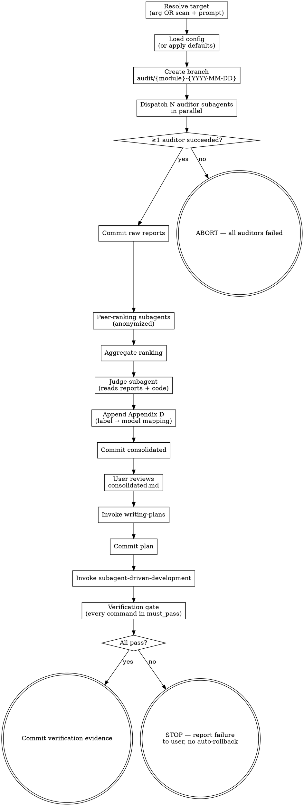

# Auditing Codebase

## Overview

Orchestrates an end-to-end multi-model code audit on a dedicated git branch:
parallel auditors → anonymous peer-ranking → judge that verifies findings against
the source code → prioritized consolidated report → remediation plan → verified
implementation. The lens (`rust-review`, `improve-codebase-architecture`,
`rust-perf`, ...) is configurable; the skill itself is lens-agnostic.

**Core principle:** *Multiple independent perspectives, anonymized peer ranking,
and a judge that proves every Confirmed finding against the actual code —
delivered on a branch the user can inspect, reject, or merge at their leisure.*

## When to Use

- Auditing a Rust crate, module, or workspace before a refactor or release
- Wanting cross-model consensus on what is wrong with a piece of code
- Needing a reproducible audit trail (raw reports + consolidated + plan + commits) in git
- Wanting findings prioritized by severity and quick-win surfaced

**Do NOT use:**
- For single-file ad hoc reviews — just invoke the lens skill directly
- For non-Rust codebases (in this iteration; verification commands are Rust-centric)
- When you cannot afford the time/cost of N parallel model calls

## Configuration

Looks for `docs/audits/audit-config.yaml` in the repo root. If missing, applies
these defaults:

```yaml
auditors: [deepseek-v4-pro, gemini-3.5-flash, glm-5.1]   # uses first N where N = --auditors flag (default 3)
judge: claude-opus-4-7
lens: rust-review
verification:
  must_pass:
    - cargo build --workspace --all-targets
    - cargo test --workspace --all-features
    - cargo clippy --workspace --all-targets --all-features -- -D warnings
    - cargo fmt --all -- --check
```

A template lives at `skills/auditing-codebase/audit-config.example.yaml`.

Prompt templates used during orchestration:
- `skills/auditing-codebase/auditor-prompt-template.md` — per-auditor prompt (Step 3)
- `skills/auditing-codebase/peer-ranking-prompt-template.md` — peer-ranking prompt (Step 4)
- `skills/auditing-codebase/judge-prompt-template.md` — judge consolidation prompt (Step 5)

### CLI flags (override config)

| Flag | Range | Default |
|---|---|---|
| `--auditors=N` | 1–4 | 3 |
| `--lens=<skill>` | any installed skill | `rust-review` |
| `--target=<path>` | repo-relative path | positional arg or interactive prompt |

## Artifacts Produced

```
docs/audits/
  {module}-a.md                       raw report, auditor a
  {module}-b.md                       raw report, auditor b
  {module}-c.md                       raw report, auditor c (if N≥3)
  {module}-d.md                       raw report, auditor d (if N=4)
  {module}-consolidated.md            judge output
  {module}-todos.md                   TODO list derived from consolidated
```

Branch: `audit/{module}-{YYYY-MM-DD}` (always; never worktrees).

Commits (in order on the audit branch):
1. `audit: add raw audit reports for {module}`
2. `audit: add consolidated findings for {module}`
3. `audit: add TODO list for {module}`
4. *(one or more commits from subagent-driven-development, per task)*
5. `audit: verification passed for {module}` — only if the gate passes

## Process Flow



## Procedure

See [procedure.md](./procedure.md) for the full step-by-step orchestration procedure.

## Hard Rules (close every loophole)

- **Branch always.** Never run any of the steps above against the user's
  current working branch. If you cannot create the dedicated branch, STOP.
- **No auto-rollback.** A failed verification gate means STOP, not revert.
- **No auto-repair.** Do not dispatch "fixer" subagents to make the gate pass.
- **No skipping verification commands.** Run every command in `must_pass`. If
  one is unavailable on the system (e.g. `cargo` not on PATH), that is a
  verification failure, not a reason to skip.
- **No model names in peer ranking or judge prompts.** Only labels.
- **No fabricated findings.** The judge consolidates; it does not invent.
- **Failure tolerance only at Step 3.** Anywhere else, failure means STOP and
  ask the user.

## Red Flags — STOP and reconsider

- "I'll just skip clippy this once." → STOP. Run it.
- "I'll fix the failing test myself in a quick patch." → STOP. Hand to user.
- "The judge can also add findings the auditors missed." → STOP. The judge consolidates only.
- "Worktrees would be cleaner." → STOP. We use a branch — it's the design.
- "All three auditors agreed, so I'll skip code verification." → STOP. Verify against source.

## Common Rationalizations

| Excuse | Reality |
|---|---|
| "All auditors agreed, must be true." | Models share blind spots. The judge MUST read the code. |
| "Cargo test takes too long." | Defining "done" without tests passing is defining it incorrectly. |
| "One auditor timed out, let me retry until I have 3." | Failure tolerance is by design. Continue with survivors. |
| "The plan is small, I can inline-execute it." | Use subagent-driven-development. Per-task commits matter. |
| "Let me reorder findings by my own judgment." | The judge already prioritized; respect Quick Wins → Critical → ... |


## Cross-Referenced Skills

- **REQUIRED SUB-SKILL:** `superpowers:dispatching-parallel-agents` — for Steps 3 and 4.
- `superpowers:writing-plans` — optional, only if you want a full implementation plan instead of the default TODO list.
- **REQUIRED SUB-SKILL:** `superpowers:subagent-driven-development` — for Step 8.
- **REQUIRED SUB-SKILL:** `superpowers:verification-before-completion` — the philosophy behind Step 9.

