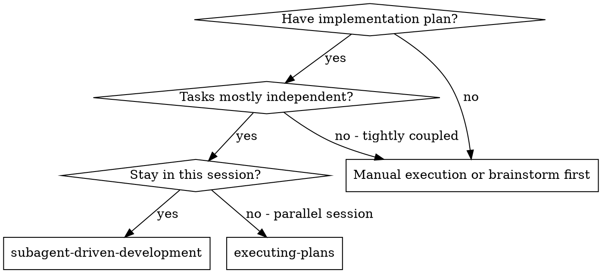

# Subagent-Driven Development

Execute plan by dispatching fresh subagent per task, with two-stage review after each: spec compliance review first, then code quality review.

**Why subagents:** You delegate tasks to specialized agents with isolated context. By precisely crafting their instructions and context, you ensure they stay focused and succeed at their task. They should never inherit your session's context or history — you construct exactly what they need. This also preserves your own context for coordination work.

**Core principle:** Fresh subagent per task + two-stage review (spec then quality) = high quality, fast iteration

**Parallelism:** Tasks that touch independent files can run in parallel using `Agent()` with `run_in_background: true`, then collecting results with `get_subagent_result()`. Tasks with shared file dependencies must run sequentially.

## When to Use



**vs. Executing Plans (parallel session):**
- Same session (no context switch)
- Fresh subagent per task (no context pollution)
- Two-stage review after each task: spec compliance first, then code quality
- Faster iteration (no human-in-loop between tasks)

## The Process

```dot
digraph process {
    rankdir=TB;

    "Read plan, extract all tasks with full text, note context, create TodoWrite" [shape=box];
    "Analyze task independence: which tasks touch independent files?" [shape=diamond];

    subgraph cluster_parallel {
        label="Parallel Batch (independent tasks)";
        "Dispatch parallel implementers via Agent(run_in_background:true)" [shape=box];
        "Collect all results via get_subagent_result(wait:true)" [shape=box];
        "Dispatch parallel spec reviewers via Agent(run_in_background:true)" [shape=box];
        "All spec reviews pass?" [shape=diamond];
        "Fix failing tasks (re-dispatch implementers)" [shape=box];
        "Dispatch parallel code quality reviewers via Agent(run_in_background:true)" [shape=box];
        "All quality reviews pass?" [shape=diamond];
        "Fix quality issues (re-dispatch implementers)" [shape=box];
    }

    subgraph cluster_sequential {
        label="Sequential (dependent tasks)";
        "Dispatch implementer via Agent() (./implementer-prompt.md)" [shape=box];
        "Implementer subagent asks questions?" [shape=diamond];
        "Answer questions via steer_subagent()" [shape=box];
        "Implementer subagent implements, tests, commits, self-reviews" [shape=box];
        "Dispatch spec reviewer via Agent() (./spec-reviewer-prompt.md)" [shape=box];
        "Spec reviewer confirms code matches spec?" [shape=diamond];
        "Fix spec gaps" [shape=box];
        "Dispatch code quality reviewer via Agent() (./code-quality-reviewer-prompt.md)" [shape=box];
        "Code quality reviewer approves?" [shape=diamond];
        "Fix quality issues (sequential)" [shape=box];
        "Mark task complete in TodoWrite" [shape=box];
    }

    "More tasks remain?" [shape=diamond];
    "Dispatch final code reviewer subagent for entire implementation" [shape=box];
    "Use superpowers:finishing-a-development-branch" [shape=box style=filled fillcolor=lightgreen];

    "Read plan, extract all tasks with full text, note context, create TodoWrite" -> "Analyze task independence: which tasks touch independent files?";
    "Analyze task independence: which tasks touch independent files?" -> "Dispatch parallel implementers via Agent(run_in_background:true)" [label="independent"];
    "Analyze task independence: which tasks touch independent files?" -> "Dispatch implementer via Agent() (./implementer-prompt.md)" [label="dependent"];

    "Dispatch parallel implementers via Agent(run_in_background:true)" -> "Collect all results via get_subagent_result(wait:true)";
    "Collect all results via get_subagent_result(wait:true)" -> "Dispatch parallel spec reviewers via Agent(run_in_background:true)";
    "Dispatch parallel spec reviewers via Agent(run_in_background:true)" -> "All spec reviews pass?";
    "All spec reviews pass?" -> "Fix failing tasks (re-dispatch implementers)" [label="no"];
    "Fix failing tasks (re-dispatch implementers)" -> "Dispatch parallel spec reviewers via Agent(run_in_background:true)";
    "All spec reviews pass?" -> "Dispatch parallel code quality reviewers via Agent(run_in_background:true)" [label="yes"];
    "Dispatch parallel code quality reviewers via Agent(run_in_background:true)" -> "All quality reviews pass?";
    "All quality reviews pass?" -> "Fix quality issues (re-dispatch implementers)" [label="no"];
    "Fix quality issues (re-dispatch implementers)" -> "Dispatch parallel code quality reviewers via Agent(run_in_background:true)";
    "All quality reviews pass?" -> "More tasks remain?" [label="yes"];

    "Dispatch implementer via Agent() (./implementer-prompt.md)" -> "Implementer subagent asks questions?";
    "Implementer subagent asks questions?" -> "Answer questions via steer_subagent()" [label="yes"];
    "Answer questions via steer_subagent()" -> "Dispatch implementer via Agent() (./implementer-prompt.md)";
    "Implementer subagent asks questions?" -> "Implementer subagent implements, tests, commits, self-reviews" [label="no"];
    "Implementer subagent implements, tests, commits, self-reviews" -> "Dispatch spec reviewer via Agent() (./spec-reviewer-prompt.md)";
    "Dispatch spec reviewer via Agent() (./spec-reviewer-prompt.md)" -> "Spec reviewer confirms code matches spec?";
    "Spec reviewer confirms code matches spec?" -> "Fix spec gaps" [label="no"];
    "Fix spec gaps" -> "Dispatch spec reviewer via Agent() (./spec-reviewer-prompt.md)" [label="re-review"];
    "Spec reviewer confirms code matches spec?" -> "Dispatch code quality reviewer via Agent() (./code-quality-reviewer-prompt.md)" [label="yes"];
    "Dispatch code quality reviewer via Agent() (./code-quality-reviewer-prompt.md)" -> "Code quality reviewer approves?";
    "Code quality reviewer approves?" -> "Fix quality issues (sequential)" [label="no"];
    "Fix quality issues (sequential)" -> "Dispatch code quality reviewer via Agent() (./code-quality-reviewer-prompt.md)" [label="re-review"];
    "Code quality reviewer approves?" -> "Mark task complete in TodoWrite" [label="yes"];
    "Mark task complete in TodoWrite" -> "More tasks remain?";

    "More tasks remain?" -> "Dispatch implementer via Agent() (./implementer-prompt.md)" [label="yes - dependent"];
    "More tasks remain?" -> "Dispatch parallel implementers via Agent(run_in_background:true)" [label="yes - independent batch"];
    "More tasks remain?" -> "Dispatch final code reviewer subagent for entire implementation" [label="no"];
    "Dispatch final code reviewer subagent for entire implementation" -> "Use superpowers:finishing-a-development-branch";
}
```



## Parallelism with Agent()

The `@tintinweb/pi-subagents` package provides `Agent()`, `get_subagent_result()`, and `steer_subagent()` tools. Use `run_in_background: true` for parallel execution when tasks are independent (no shared file edits).

### Assessing Independence

A task is independent if:
- It touches files no other concurrent task touches
- It doesn't depend on output from another in-flight task
- Its tests don't share state with other tasks' tests

**Run in parallel:** Different modules, different features, different test files with isolated fixtures
**Run sequentially:** Shared config files, shared types/interfaces, tasks that build on each other's output

### Parallel Dispatch Pattern

```
# Implementers in parallel (all touch independent files)
Agent({ subagent_type: "worker", prompt: "Implement Task 1: [full text + context]", description: "Task 1: hook install script", run_in_background: true })
# → returns agent_id: "agent-1"
Agent({ subagent_type: "worker", prompt: "Implement Task 2: [full text + context]", description: "Task 2: recovery modes", run_in_background: true })
# → returns agent_id: "agent-2"
Agent({ subagent_type: "worker", prompt: "Implement Task 3: [full text + context]", description: "Task 3: config parser", run_in_background: true })
# → returns agent_id: "agent-3"

# Wait for all to complete
get_subagent_result({ agent_id: "agent-1", wait: true })
get_subagent_result({ agent_id: "agent-2", wait: true })
get_subagent_result({ agent_id: "agent-3", wait: true })

# After all complete, spec reviewers in parallel
Agent({ subagent_type: "reviewer", prompt: "Spec compliance for Task 1: [requirements + T1 report]", description: "Spec review: Task 1", run_in_background: true })
Agent({ subagent_type: "reviewer", prompt: "Spec compliance for Task 2: [requirements + T2 report]", description: "Spec review: Task 2", run_in_background: true })
Agent({ subagent_type: "reviewer", prompt: "Spec compliance for Task 3: [requirements + T3 report]", description: "Spec review: Task 3", run_in_background: true })

# Wait for all, then dispatch quality reviewers the same way
```

### Sequential Dispatch Pattern

```
# Single foreground agent (blocks until complete)
Agent({ subagent_type: "worker", prompt: "Implement Task 4: [full text + context]", description: "Task 4: integration layer" })

# If the agent needs guidance mid-task:
steer_subagent({ agent_id: "agent-4", message: "The config format changed — use TOML not YAML. See src/config.toml for the schema." })
```

**Max concurrency:** Up to 4 agents run concurrently by default. Configurable via `/agents` → Settings.

**Streaming:** All parallel agents stream updates simultaneously. You see live progress from all tasks at once.

### Handling Mixed Results from Parallel Batches

When some parallel tasks fail and others succeed:
1. Don't re-run the successful tasks
2. Re-dispatch only the failed tasks (parallel or sequential depending on count)
3. Proceed to review once all are green

## Model Selection

Models are configured per agent type. There are three ways to set a model, in order of precedence:

1. **`model` parameter on Agent() call** — overrides everything for that specific dispatch:
   ```
   Agent({ subagent_type: "worker", prompt: "...", description: "...", model: "haiku" })
   ```

2. **Agent `.md` frontmatter** — set the `model:` field in the agent definition file (e.g., `agents/worker.md`). Applies to all dispatches of that agent type unless overridden by (1). Supports fuzzy names (e.g., `"haiku"`, `"sonnet"`) or exact identifiers (e.g., `"anthropic/claude-sonnet-4-6"`).

3. **Inherit parent model** — if neither (1) nor (2) specifies a model, the subagent inherits the parent agent's model.

**Agent types:**
- Custom agents defined in `agents/*.md` files: `worker`, `scout`, `reviewer`, `planner`
- Built-in agent types: `general-purpose`, `Explore`, `Plan`

**Guideline:** Use the least powerful model that can handle each task to conserve cost and increase speed. Most implementation tasks are mechanical when the plan is well-specified — a fast model suffices. Reserve capable models for architecture, design, integration, and review tasks.

## Cost Tracking

Each subagent reports its own usage stats in the result. The format is:

```
⟳3 · 12 tool uses · 8.2k token · 14s
```

This shows: turns, tool invocations, token usage, and wall-clock time.

**Quick mental math:**
- 5 tasks x 3 subagent rounds (implementers + 2 reviewer rounds) = 15 subagent runs
- Parallel: 3 rounds instead of 15 sequential dispatches
- If each averages $0.005, total ~ $0.075

## Handling Implementer Status

Implementer subagents report one of four statuses. Handle each appropriately:

**DONE:** Proceed to spec compliance review.

**DONE_WITH_CONCERNS:** The implementer completed the work but flagged doubts. Read the concerns before proceeding. If the concerns are about correctness or scope, address them before review. If they're observations (e.g., "this file is getting large"), note them and proceed to review.

**NEEDS_CONTEXT:** The implementer needs information that wasn't provided. Provide the missing context and re-dispatch.

**BLOCKED:** The implementer cannot complete the task. Assess the blocker:
1. If it's a context problem, provide more context and re-dispatch
2. If the task requires more reasoning, re-dispatch with a more capable model via the `model` parameter
3. If the task is too large, break it into smaller pieces
4. If the plan itself is wrong, escalate to the human

**Never** ignore an escalation or force the same model to retry without changes. If the implementer said it's stuck, something needs to change.

## Prompt Templates

- `./implementer-prompt.md` - Dispatch implementer subagent
- `./spec-reviewer-prompt.md` - Dispatch spec compliance reviewer subagent
- `./code-quality-reviewer-prompt.md` - Dispatch code quality reviewer subagent

## Example Workflow

```
You: I'm using Subagent-Driven Development to execute this plan.

[Read plan file once: docs/plans/feature-plan.md]
[Extract all 5 tasks with full text and context]
[Create TodoWrite with all tasks]

[Assess independence: Tasks 1, 2, 3 are independent modules. Tasks 4, 5 depend on Task 3 output.]

=== Parallel Batch: Tasks 1, 2, 3 ===

[Dispatch parallel implementers]
Agent({ subagent_type: "worker", prompt: "Implement Task 1: Hook installation script. [full text]...", description: "Task 1: hook install", run_in_background: true })
# → agent_id: "agent-1"
Agent({ subagent_type: "worker", prompt: "Implement Task 2: Recovery modes. [full text]...", description: "Task 2: recovery modes", run_in_background: true })
# → agent_id: "agent-2"
Agent({ subagent_type: "worker", prompt: "Implement Task 3: Config parser. [full text]...", description: "Task 3: config parser", run_in_background: true })
# → agent_id: "agent-3"

[Live streaming: all 3 agents working simultaneously]

[Collect results]
get_subagent_result({ agent_id: "agent-1", wait: true })  # ✓
get_subagent_result({ agent_id: "agent-2", wait: true })  # ✓
get_subagent_result({ agent_id: "agent-3", wait: true })  # ✓

[Dispatch parallel spec reviewers]
Agent({ subagent_type: "reviewer", prompt: "Spec compliance for Task 1: [requirements + T1 report]", description: "Spec review: Task 1", run_in_background: true })
Agent({ subagent_type: "reviewer", prompt: "Spec compliance for Task 2: [requirements + T2 report]", description: "Spec review: Task 2", run_in_background: true })
Agent({ subagent_type: "reviewer", prompt: "Spec compliance for Task 3: [requirements + T3 report]", description: "Spec review: Task 3", run_in_background: true })

[Collect spec review results]
Task 1: ✅ Spec compliant
Task 2: ❌ Missing: Progress reporting (spec says "report every 100 items")
Task 3: ✅ Spec compliant

[Re-dispatch only Task 2 implementer to fix]
Agent({ subagent_type: "worker", prompt: "Fix Task 2: add progress reporting every 100 items. [details]", description: "Fix Task 2: progress reporting" })

[Re-run spec review for Task 2 only]
Agent({ subagent_type: "reviewer", prompt: "Re-review spec compliance for Task 2: [requirements + fix report]", description: "Re-review: Task 2 spec" })
Task 2: ✅ Spec compliant

[Dispatch parallel code quality reviewers for all 3]
Agent({ subagent_type: "reviewer", prompt: "Code quality for Task 1: base sha X, head sha Y...", description: "Quality review: Task 1", run_in_background: true })
Agent({ subagent_type: "reviewer", prompt: "Code quality for Task 2: base sha X, head sha Y...", description: "Quality review: Task 2", run_in_background: true })
Agent({ subagent_type: "reviewer", prompt: "Code quality for Task 3: base sha X, head sha Y...", description: "Quality review: Task 3", run_in_background: true })

[Collect quality review results]
All ✅ — mark Tasks 1, 2, 3 complete in TodoWrite

=== Sequential: Task 4 (depends on Task 3) ===

[Dispatch single implementer]
Agent({ subagent_type: "worker", prompt: "Implement Task 4: [full text + Task 3 output]", description: "Task 4: integration layer" })
...
[spec review → quality review → complete]

=== Sequential: Task 5 (depends on Task 4) ===
...

[All tasks complete]
[Dispatch final code reviewer]
[Use superpowers:finishing-a-development-branch]
```

## Advantages

**vs. Manual execution:**
- Subagents follow TDD naturally
- Fresh context per task (no confusion)
- Parallel-safe (subagents don't interfere)
- Subagent can ask questions (before AND during work via steer_subagent)

**vs. Executing Plans:**
- Same session (no handoff)
- Continuous progress (no waiting)
- Review checkpoints automatic

**Parallelism gains:**
- Independent tasks run simultaneously (up to 4 concurrent, configurable via `/agents` → Settings)
- All 3 reviewer rounds run in parallel per batch
- Streaming shows live progress from all agents at once
- Significant wall-clock time reduction for multi-task plans

**Efficiency gains:**
- No file reading overhead (controller provides full text)
- Controller curates exactly what context is needed
- Subagent gets complete information upfront
- Questions surfaced before work begins (not after)

**Quality gates:**
- Self-review catches issues before handoff
- Two-stage review: spec compliance, then code quality
- Review loops ensure fixes actually work
- Spec compliance prevents over/under-building
- Code quality ensures implementation is well-built

**Cost:**
- More subagent invocations (implementer + 2 reviewer rounds per batch)
- But parallel execution reduces wall-clock time significantly
- Controller does more prep work (extracting all tasks upfront)
- Catches issues early (cheaper than debugging later)

## Red Flags

**Never:**
- Start implementation on main/master branch without explicit user consent
- Skip reviews (spec compliance OR code quality)
- Proceed with unfixed issues
- **Dispatch parallel implementers on tasks that share files (causes merge conflicts)**
- Make subagent read plan file (provide full text instead)
- Skip scene-setting context (subagent needs to understand where task fits)
- Ignore subagent questions (answer before letting them proceed)
- Accept "close enough" on spec compliance (spec reviewer found issues = not done)
- Skip review loops (reviewer found issues = implementer fixes = review again)
- Let implementer self-review replace actual review (both are needed)
- **Start code quality review before spec compliance is ✅** (wrong order)
- Move to next task while either review has open issues

**Parallel is SAFE for:**
- Reviewers (read-only, never edit code)
- Implementers on truly independent files

**Parallel is UNSAFE for:**
- Implementers touching the same files
- Tasks where Task B needs Task A's output

**If subagent asks questions:**
- Answer clearly and completely via `steer_subagent()`
- Provide additional context if needed
- Don't rush them into implementation

**If reviewer finds issues:**
- Implementer (same subagent re-dispatched) fixes them
- Reviewer reviews again
- Repeat until approved
- Don't skip the re-review

**If subagent fails task:**
- Dispatch fix subagent with specific instructions
- Don't try to fix manually (context pollution)

## Integration

**Required workflow skills:**
- **superpowers:using-git-worktrees** - REQUIRED: Set up isolated workspace before starting
- **superpowers:writing-plans** - Creates the plan this skill executes
- **superpowers:requesting-code-review** - Code review template for reviewer subagents
- **superpowers:finishing-a-development-branch** - Complete development after all tasks

**Subagents should use:**
- **superpowers:test-driven-development** - Subagents follow TDD for each task

**Alternative workflow:**
- **superpowers:executing-plans** - Use for parallel session instead of same-session execution
